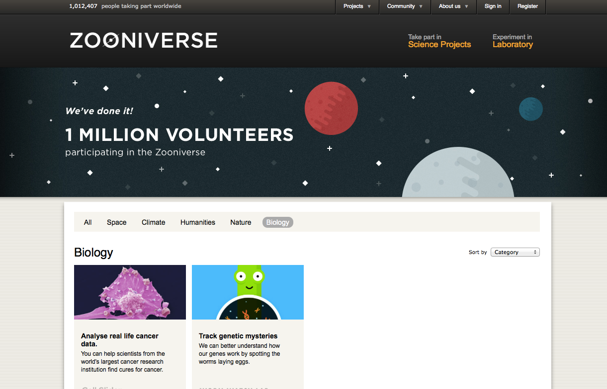
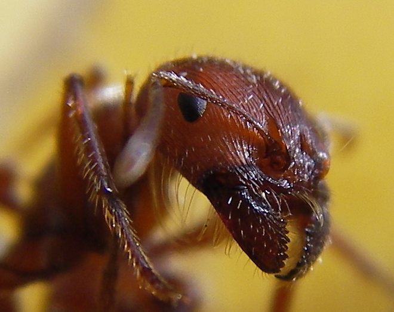

## Crowdsourcing gene predictions & estimating population sizes

[bmpvieira.com/seminar14](//bmpvieira.com/seminar14)

Bruno Vieira | <i class="fa fa-twitter"></i> [@bmpvieira](//twitter.com/bmpvieira)

---
## Bioinformatics & Population Genomics

---

### Initially address two issues

 
Scaling up gene prediction

 

Infer the efective population size history in insects with the PSMC method [(Li, 2011)](//dx.doi.org/10.1038/nature10231).

---

## Gene prediction?

---

<section data-background="img/dalliance.png"></section>

---

### Why is this important?

Genes are the basic building block of organisms

---

### How?

<small>
Gene prediction models
 [(Sleator, 2010)](//dx.doi.org/10.1016/j.gene.2010.04.008)
</small>

---

<section data-background="img/MAKER.jpg"></section>

---

<section data-background="img/ngs.png"></section>

---

> Web application to crowdsource gene prediction 

<i class="fa fa-github-alt"></i> [github.com/yeban/afra](//github.com/yeban/afra)

---

## Crowdsource?

---

### Crowd + Outsource

<!--  -->

<section data-background="img/crowd-original-background.jpg">
  
</section>

---

### Citizen Science

<!--  -->

<section data-background="img/citizen_science-background.jpg">
  
  

    <small>
      James Borrell | <i class="fa fa-twitter"></i> [@James_Borrell](//twitter.com/James_Borrell)
       
      Citizen Cyberscience Summit 2014 | <i class="fa fa-twitter"></i> [#ccs14](//twitter.com/#ccs14)
    </small>
  

</section>

---

### Self-reward helping Science

Zooniverse success

---

### Science? I don't care...

 

---

### Cognitive surplus

<small>
[Shirky, 2010](http://www.informationisbeautiful.net/2010/cognitive-surplus-visualized)
</small>

---

## Gamification

---

### Gamification

>  A way to engage users into solving a problem by adding game mechanics to it

---

### Useless game - Flappy bird

50 milion downloads

<small>
<i class="fa fa-link"></i> [flappybird.io](//http://flappybird.io)
</small>

---

### Useful - Genes In Space

<small>
<i class="fa fa-link"></i> [http://www.cancerresearchuk.org](//www.cancerresearchuk.org/support-us/play-to-cure-genes-in-space)
</small>

---

<section data-background="img/afra-demo-tutorial.png"></section>

---

<section data-background="img/afra-demo-editing.mov.gif"></section>

---

<section data-background="img/afra-demo-tutorial-highlight.png"></section>

---

## Previous work

---

### Scale up and Gamify another Open Source project

<i class="fa fa-github-alt"></i> [gmod/apollo](//github.com/gmod/apollo)
→
<i class="fa fa-github-alt"></i> [yeban/afra](//github.com/yeban/afra)

 

 Anurag Priyam | <i class="fa fa-twitter"></i> [@yeban](//twitter.com/yeban)

---

## Current work

---

### Scale up

Move most of the logic to the browser

---

### Scale up
Biology logic on the browser

<i class="fa fa-github-alt"></i> [github.com/bionode/bionode](//github.com/bionode/bionode)

---

### Gamification

Dashboad mockup

---

### Machine Learning

Use data generated by users to improve gene prediction models

<section data-background="img/machine-learning-background.png">
  
  

    <small>
      Robert Simpson | <i class="fa fa-twitter"></i> [@orbitingfrog](//twitter.com/orbitingfrog)
       
      Citizen Cyberscience Summit 2014 | <i class="fa fa-twitter"></i> [#ccs14](//twitter.com/#ccs14)
    </small>
  

</section>

---

## PSMC

---

### Effective population size?

<!-- > "the number of breeding individuals in an idealised population that would show the same amount of dispersion of allele frequencies under random genetic drift or the same amount of inbreeding as the population under consideration" Wright, 1931 -->

>  Theoretical number of individuals that contribute gametes to the next generation

---

### Why is this important?

 
Measure of genetic diversity

 

Affects selection efficiency

---

### Used

Effect of historical climate changes (Miller, 2012)</small>

Measure the impact of anthropogenic activity(Zhao, 2013)</small>

Discover unexpected population bottlenecks (Freedman, 2014)</small>

Detect the time of divergence between populations (Li, 2011)</small>

---

### How to measure?

 
Previously hard to do

<ul>
<li class="fragment">Highly stochastic nature of inbreeding and genetic drift</li>
<li class="fragment">Other confounding factors</li>
<li class="fragment">Needs a lot of specific data</li>
</ul>

 

Now from a diploid genome

---

### PSMC

[Li, 2011](//dx.doi.org/10.1038/nature10231)

---

## Hasn't been used in insects a lot... until now!

---
### Use PSMC to answer some evolutionary questions

---

## Is the effective population size in solitary insects > social?

---

### Experimental design
Run PSMC across a wide range of social insects and their solitary relatives

---

## Current work

---

### Reproducing published results to master PSMC

* [Li, 2011](//dx.doi.org/10.1038/nature10231)
* [Freedman, 2014](//dx.doi.org/10.1371/journal.pgen.1004016)

---

### Thank you!

Bruno Vieira | <i class="fa fa-twitter"></i> [@bmpvieira](//twitter.com/bmpvieira)

Anurag Priyam | <i class="fa fa-twitter"></i> [@yeban](//twitter.com/yeban)

Yannick Wurm | <i class="fa fa-twitter"></i> [@yannick__](//twitter.com/yannick__)

[bmpvieira.com/seminar14](//bmpvieira.com/seminar14)

<small>
© 2014 [Bruno Vieira](//bmpvieira.com) [CC-BY 4.0](//creativecommons.org/licenses/by/4.0/deed.en_US)
</small>

---

Crowdsource gene prediction
<ul style="text-align: left; line-height:1.5em;">
<li> Address data "deluge" in gene prediction</li>
<li> Scale up by moving logics to browser</li>
<li> Gamify to tap into Cognitive Surplus</li>
</ul>

Effective pop. size history in insects
<ul style="text-align: left; line-height:1.5em;">
<li> Deploy the PSMC on the servers</li>
<li> Master PSMC by reproducing results</li>
<li> Effective pop. size solitary insects > social?</li>
</ul>

---
