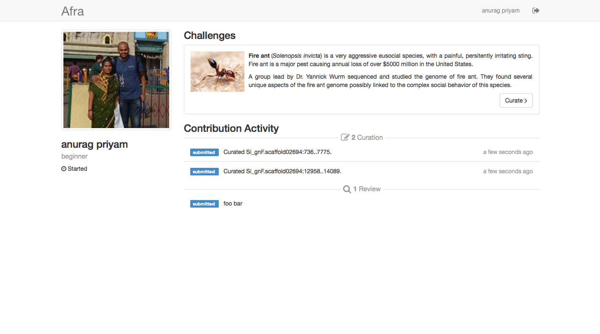
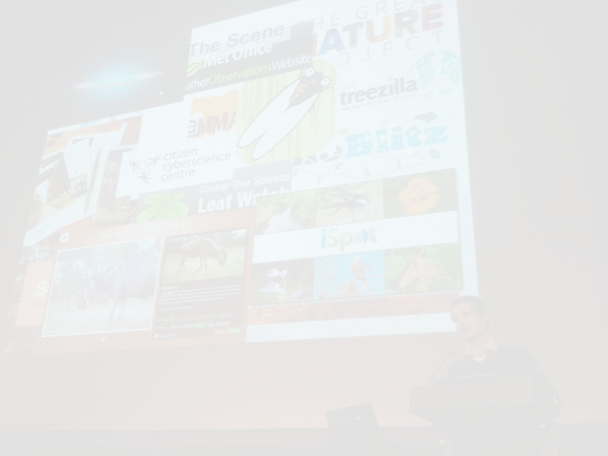
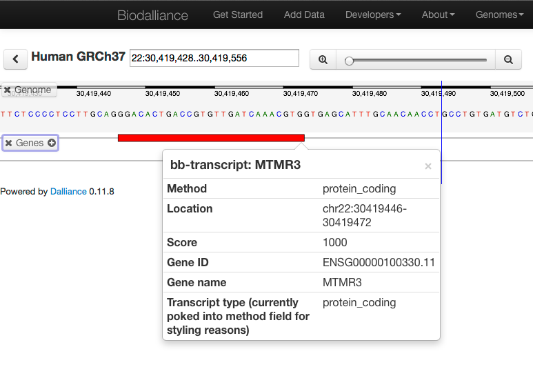
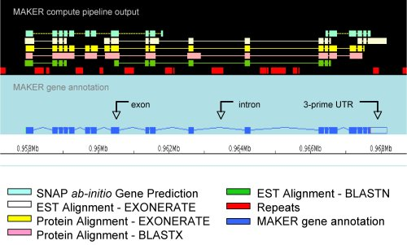
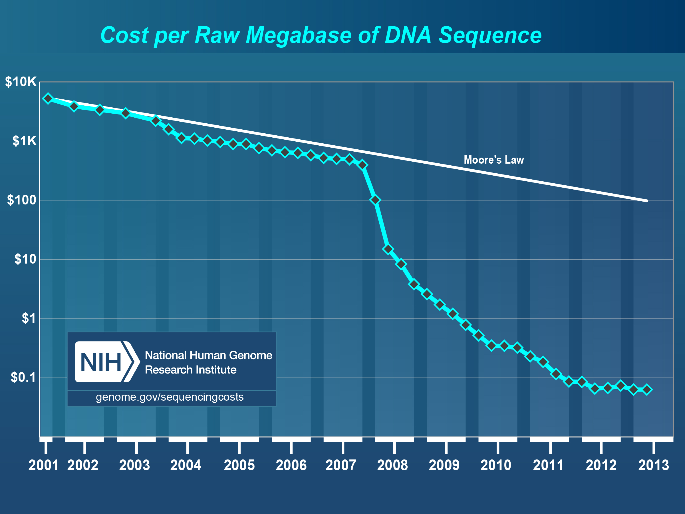
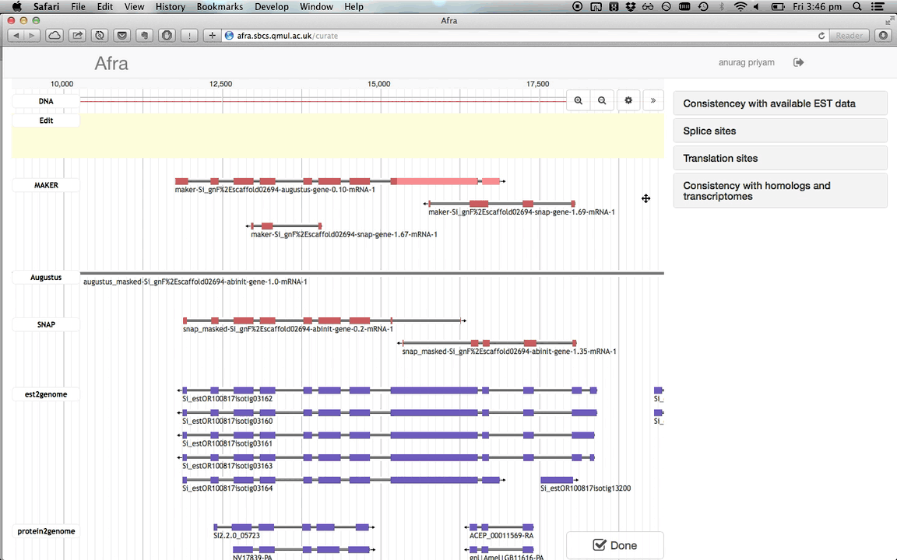
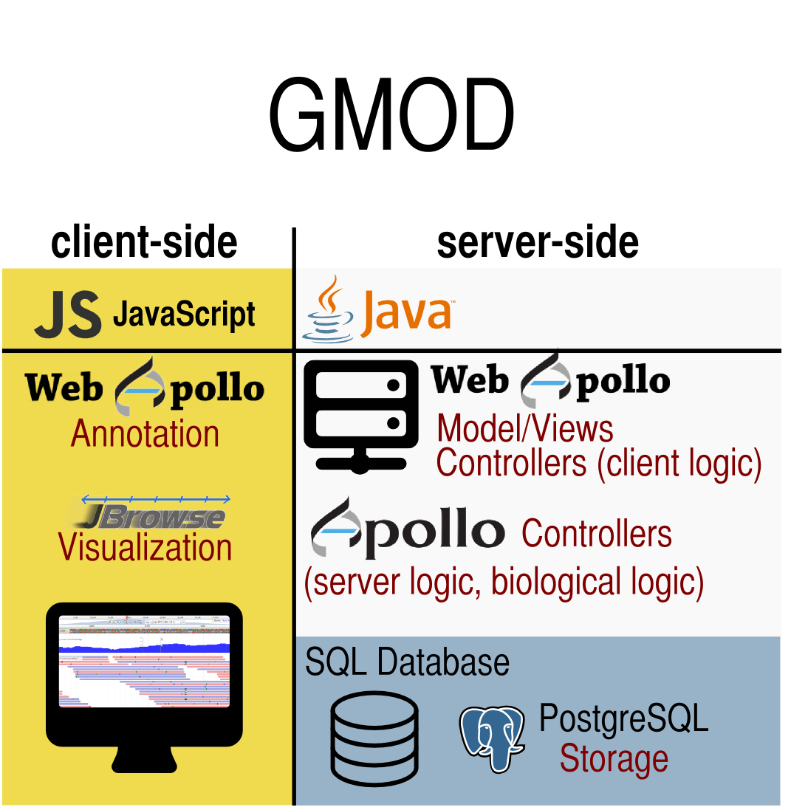
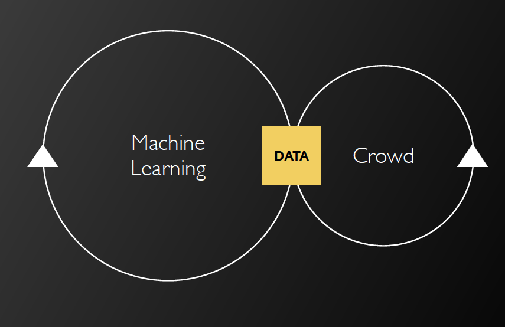
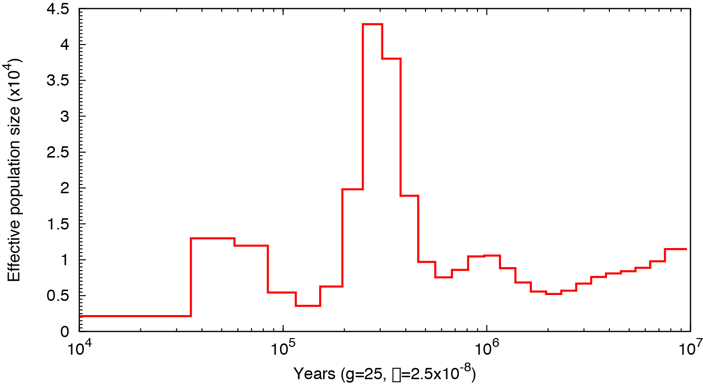
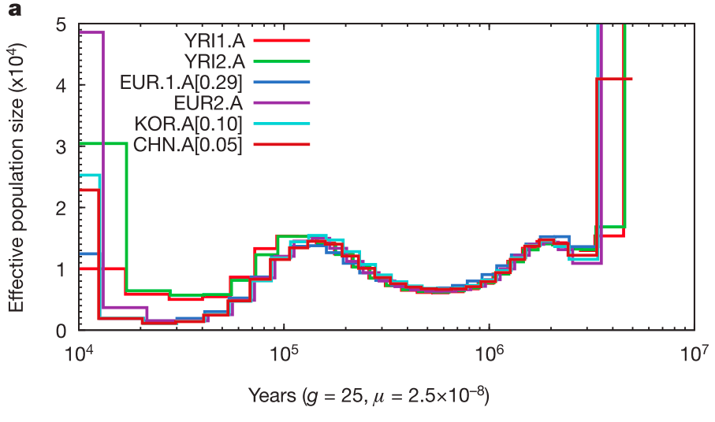

## Crowdsourcing gene predictions & estimating population sizes

[bmpvieira.com/seminar14](//bmpvieira.com/seminar14)

Bruno Vieira | <i class="fa fa-twitter"></i> [@bmpvieira](//twitter.com/bmpvieira)

---
## Bioinformatics and Population Genomics

---

### Initially address two issues

* Scaling gene prediction
* *Ne* inference in insects with the Pairwise Sequentially Markovian Coalescent (PSMC) method.

---

## Two Projects    Afra & PSMC

---

### Afra

> Web application to crowdsource gene prediction

<i class="fa fa-github-alt"></i> [github.com/yeban/afra](//github.com/yeban/afra)

---

### PSMC

> Pairwise Sequentially Markovian Coalescent¹ method on insect genomes for inference of the population size history

<i class="fa fa-github-alt"></i> [github.com/lh3/psmc](//https://github.com/lh3/psmc)

<small>
¹ Li, H., & Durbin, R. (2011). Inference of human population history from individual whole-genome sequences. *Nature, 475* (7357), 493–6. [doi:10.1038/nature10231](//dx.doi.org/10.1038/nature10231)
</small>

---

## Afra

---

### Afra

> <strong>Web application to crowdsource gene prediction</strong>

<i class="fa fa-github-alt"></i> [github.com/yeban/afra](//github.com/yeban/afra)

---

## Web Application?

---

### Gmail, Facebook, etc.

---

### Afra

> <strong>Web application to crowdsource gene prediction</strong>

<i class="fa fa-github-alt"></i> [github.com/yeban/afra](//github.com/yeban/afra)

---

## Crowdsource?

---

### Crowd + Outsource

<!--  -->

<section data-background="img/crowd-original-background.jpg">
  
</section>

---

### Citizen Science

<!--  -->

<section data-background="img/citizen_science-background.jpg">
  
  

    <small>
      James Borrell | <i class="fa fa-twitter"></i> [@James_Borrell](//twitter.com/James_Borrell)
       
      Citizen Cyberscience Summit 2014 | <i class="fa fa-twitter"></i> [#ccs14](//twitter.com/#ccs14)
    </small>
  

</section>

---

### Self-reward helping Science

Zooniverse success

---

### Lazy people don't care...

 

---

### Cognitive surplus

---

## Gamification

---

### Useless game | Flappy bird

50 milion downloads | $50 000 per day

<small>
<i class="fa fa-link"></i> [flappybird.io](//http://flappybird.io)
</small>

---

### Useful | Genes In Space

<small>
<i class="fa fa-link"></i> [http://www.cancerresearchuk.org](//www.cancerresearchuk.org/support-us/play-to-cure-genes-in-space)
</small>

---

### Useful | Genes In Space

<small>
<i class="fa fa-link"></i> [http://www.cancerresearchuk.org](//http://scienceblog.cancerresearchuk.org/2014/02/04/download-our-revolutionary-mobile-game-to-help-speed-up-cancer-research/)
</small>

---

### Afra

> <strong>Web application to crowdsource gene prediction</strong>

<i class="fa fa-github-alt"></i> [github.com/yeban/afra](//github.com/yeban/afra)

---

## Gene prediction?

---

### Gene prediction

<small>
<i class="fa fa-link"></i> [http://www.biodalliance.org/human37.html](//www.biodalliance.org/human37.html)
</small>

---

### Gene prediction models

<small>

 Sleator, R. D. (2010). An overview of the current status of eukaryote gene prediction strategies. *Gene, 461* (1-2), 1–4. [doi:10.1016/j.gene.2010.04.008](//dx.doi.org/10.1016/j.gene.2010.04.008)

</small>

---

### MAKER

<small>
<i class="fa fa-link"></i> [http://www.gmod.org/wiki/MAKER](//www.gmod.org/wiki/MAKER)
</small>

<!-- also see http://gmod.org/wiki/File:Comparison.png -->

---

### Manual curation won't scale...

---

### Afra Demo

<i class="fa fa-github-alt"></i> [afra.sbcs.qmul.ac.uk](http://afra.sbcs.qmul.ac.uk)

---

## Previous work

---

### Main developer

Anurag Priyam | <i class="fa fa-twitter"></i> [@yeban](//twitter.com/yeban)

---

### WebApollo

<i class="fa fa-github-alt"></i> [github.com/gmod/apollo](//github.com/gmod/apollo)

<i class="fa fa-link"></i> [apollo.berkeleybop.org](//apollo.berkeleybop.org)

---

## Current work

---

### Gamification

Dashboad mockup

---
### Gamification

Dashboard HTML5 (incomplete)

---

## Priority change

---

### Annotation editing feature far from completion due to complexity of the project

---

### Software Stack

Move most of the logic to the client side (browser) for scalability

---

### Afra Stack

  

    
  

  

---

### Bionode

<i class="fa fa-github-alt"></i> [github.com/bionode/bionode](//github.com/bionode/bionode)

---

### Gamify

* Scores
* Open Badges
* Certificates of Expertise

 

<small>
<i class="fa fa-link"></i> [http://openbadges.org](//openbadges.org)
</small>

---

### Machine Learning

Use data generated by users to improve gene prediction models

<section data-background="img/machine-learning-background.png">
  
  

    <small>
      Robert Simpson | <i class="fa fa-twitter"></i> [@orbitingfrog](//twitter.com/orbitingfrog)
       
      Citizen Cyberscience Summit 2014 | <i class="fa fa-twitter"></i> [#ccs14](//twitter.com/#ccs14)
    </small>
  

</section>

---

## PSMC

---

### PSMC

> Pairwise Sequentially Markovian Coalescent¹ method on insect genomes for inference of the population size history

<i class="fa fa-github-alt"></i> [github.com/lh3/psmc](//https://github.com/lh3/psmc)

<small>
¹ Li, H., & Durbin, R. (2011). Inference of human population history from individual whole-genome sequences. *Nature, 475* (7357), 493–6. [doi:10.1038/nature10231](//dx.doi.org/10.1038/nature10231)
</small>

---

### Theory

>"The PSMC infers the local time to the most recent common ancestor (TMRCA) on the basis of the local density of heterozygotes, using a hidden Markov model"

H. Li & Durbin, 2011

---

### Practice

H. Li & Durbin, 2011

---

### Previous usages

<ul>
<li> Evaluate the effect of historical climate changes, such as glacial periods, on a species[1]</li>
<li> Measure the impact of anthropogenic activity in the decline of species[2]</li>
<li> Discover unexpected population bottlenecks[3]</li>
<li> Detect the time of divergence between populations[4]</li>
<li> etc.
<ul>

 
<small>
[1]: W. Miller & Schuster, 2012; Nadachowska-Brzyska et al., 2013;  
[2]: S. Zhao et al., 2013;  
[3]: Freedman et al., 2014;  
[4]: H. Li & Durbin, 2011.
</small>

---

## Not very used on insects... until now!

---
### Use PSMC to answer some evolutionary questions

---

## In insects, does *Ne* for solitary > social?

---

### Experimental design
Run PSMC across a wide range of insects that evolved eusociality.

---

## In ants colonies, does *Ne* for multi queen > single queen?

---
### Experimental design
Run PSMC on many ant genomes, perhaps more than the seven genomes currently sequenced and publicly available

<small>
* Jerdon's jumping ant, *Harpegnathos saltator* (Bonasio, 2010)
* Florida carpenter ant, *Camponotus floridanus* (Bonasio, 2010)
* Argentine ant, *Linepithema humile* (Smith, 2011)
* Fire ant, *Solenopsis invicta* (Wurm, 2011)
* Two leafcutter ants, *Atta cephalotes* (Suen, 2011) and *Acromyrmex echinatior* (Nygaard, 2011);
* Red harvester ant, *Pogonomyrmex barbatus* (Smith, 2011).

</small>

---
## Current work

---

### Reproducing published results to master PSMC

<ul>
<li>Li, H., & Durbin, R. (2011). **Inference of human population history from individual whole-genome sequences**. *Nature, 475* (7357), 493–6. [doi:10.1038/nature10231](//dx.doi.org/10.1038/nature10231)</li>

<li> Freedman, A. H., Gronau, I., Schweizer, R. M., Ortega-Del Vecchyo, D., Han, E., Silva, P. M., ... Novembre, J. (2014). **Genome Sequencing Highlights the Dynamic Early History of Dogs**. (L. Andersson, ed.)*PLoS Genetics, 10*(1), e1004016. [doi:10.1371/journal.pgen.1004016](//dx.doi.org/10.1371/journal.pgen.1004016)</li>a

---

### Thank you!

Bruno Vieira | <i class="fa fa-twitter"></i> [@bmpvieira](//twitter.com/bmpvieira)

Anurag Priyam | <i class="fa fa-twitter"></i> [@yeban](//twitter.com/yeban)

Yannick Wurm | <i class="fa fa-twitter"></i> [@yannick__](//twitter.com/yannick__)

[bmpvieira.com/seminar14](//bmpvieira.com/seminar14)

<small>
© 2014 [Bruno Vieira](//bmpvieira.com) [CC-BY 4.0](//creativecommons.org/licenses/by/4.0/deed.en_US)
</small>

---

### Summary
[bmpvieira.com/seminar14](//bmpvieira.com/seminar14)

Afra - crowdsource gene prediction
<small>
<ul style="text-align: left; line-height:1.5em;">
<li> Address data "deluge" with crowdsourcing and gamification</li>
<li> Make WebApollo more scalable by moving logics to client side</li>
<li> Implement biological logics in JavaScript as reusable module</li>
</ul>

</small>
PSMC - *Ne* history in insects
<small>
<ul style="text-align: left; line-height:1.5em;">
<li> Master this method by reproducing published results</li>
<li> In insects, does *Ne* for solitary > social?</li>
<li> In ants colonies, does *Ne* for multi queen > single queen?</li>
</ul>

</small>

